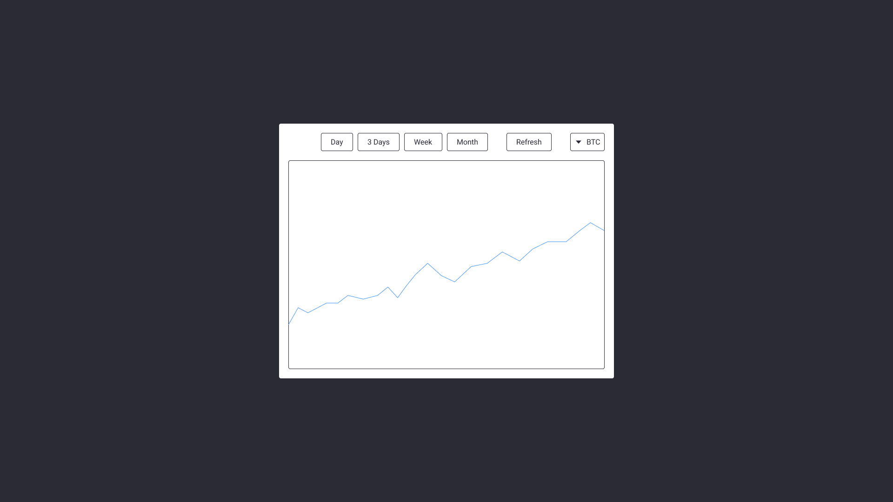

# Тестовое задание для Senior Frontend Engineer

## Задача

Нужно разработать небольшое приложение, которое будет отображать линейный почасовой график обменов определенной монеты. Внешний вид значения не имеет.

Пример возможного интерфейса:

Для разработки можно использовать API cryptocompare.com (ключ апи бесплатный):
- список монет - https://min-api.cryptocompare.com/documentation?key=Blockchain&cat=blockchainListOfCoins
- данные обменов - https://min-api.cryptocompare.com/documentation?key=Historical&cat=dataExchangeHistoHour

**Требования**:

- возможность выбрать монету из списка с помощью селекта
- возможность выбрать период с помощью радиогруппы: 1 день, 3 дня, 7 дней, 1 месяц
- кнопка обновления данных. При желании можно добавить функционал автообновления
- требований к графику нет. Технологии на ваш выбор

**Требования к верстке:**

- Cемантичность
- Доступность

**Требования к технологиям:**

- React
- Tailwind.css